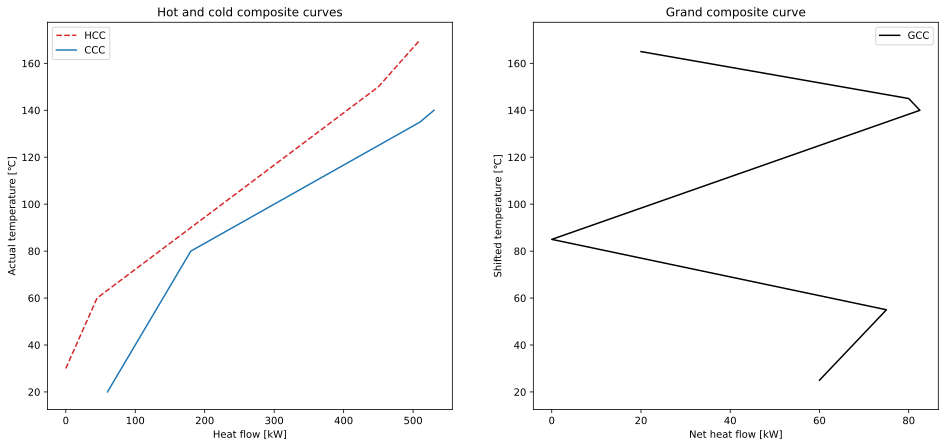

# pina


[](https://codecov.io/gh/FitzOReilly/pina)
[](https://github.com/psf/black)
[](https://timothycrosley.github.io/isort/)

## Installation
To install this package, run
```
python -m pip install pina
```

## Basic example
This is a basic example using the four stream problem from
*Pinch Analysis and Process Integration:
A User Guide On Process Integration for the Efficient Use of Energy,
Second edition, Ian C. Kemp, p. 4*. Its data looks as follows:

| Stream number and type | Heat flow [kW] | Supply Temperature [°C] | Target Temperature [°C] |
| :--- | ---: | ---: | ---: |
| 1. Cold | -230 | 20 | 135 |
| 2. Hot | 330 | 170 | 60 |
| 3. Cold | -240 | 80 | 140 |
| 4. Hot | 180 | 150 | 30 |

&Delta;*T*<sub>min</sub> = 10 K

We can input the data with the following code:
```python
from pina import PinchAnalyzer, make_stream

# Arguments: heat flow, supply temperature, target temperature
cold_1 = make_stream(-230, 20, 135)
hot_1 = make_stream(330, 170, 60)
cold_2 = make_stream(-240, 80, 140)
hot_2 = make_stream(180, 150, 30)

min_temp_diff = 10
temp_shift = min_temp_diff / 2

analyzer = PinchAnalyzer(temp_shift)
analyzer.add_streams(cold_1, hot_1, cold_2, hot_2)
```

The `PinchAnalyzer` class calculates the energy targets, the pinch
temperature(s) and the coordinates of the composite curves. The following
properties can be requested from it:
* `heating_demand`
* `cooling_demand`
* `hot_utility_target`
* `cold_utility_target`
* `heat_recovery_target`
* `pinch_temps`
* `cold_composite_curve`
* `hot_composite_curve`
* `shifted_cold_composite_curve`
* `shifted_hot_composite_curve`
* `grand_composite_curve`

For example:
```python
print(
    "Heating demand:       {}\n"
    "Cooling demand:       {}\n"
    "Hot utility target:   {}\n"
    "Cold utility target:  {}\n"
    "Heat recovery target: {}\n"
    "Pinch temperature(s): {}".format(
        analyzer.heating_demand,
        analyzer.cooling_demand,
        analyzer.hot_utility_target,
        analyzer.cold_utility_target,
        analyzer.heat_recovery_target,
        analyzer.pinch_temps,
    )
)
```

Output:
```
Heating demand:       470.0
Cooling demand:       510.0
Hot utility target:   20.0
Cold utility target:  60.0
Heat recovery target: 450.0
Pinch temperature(s): [85.0]
```

### Plotting
This package deliberately does not include any plotting functions, but using it
together with plotting libraries is simple. Here is an example that uses
`matplotlib` to create a figure with two subplots: the hot and cold composite
curves on the left and the grand composite curve on the right:
```python
from matplotlib import pyplot as plt

fig, ax = plt.subplots(1, 2, figsize=(16, 7))

ax[0].plot(*analyzer.hot_composite_curve, color="tab:red", linestyle="--", label="HCC")
ax[0].plot(*analyzer.cold_composite_curve, color="tab:blue", linestyle="-", label="CCC")
ax[0].legend()
ax[0].set_title("Hot and cold composite curves")
ax[0].set_xlabel("Heat flow [kW]")
ax[0].set_ylabel("Actual temperature [\u2103]")

ax[1].plot(*analyzer.grand_composite_curve, color="k", linestyle="-", label="GCC")
ax[1].legend()
ax[1].set_title("Grand composite curve")
ax[1].set_xlabel("Net heat flow [kW]")
ax[1].set_ylabel("Shifted temperature [\u2103]")

# Make the y-axis equal in both plots
ylims = (*ax[0].get_ylim(), *ax[1].get_ylim())
minmax_ylims = (min(ylims), max(ylims))
ax[0].set_ylim(minmax_ylims)
ax[1].set_ylim(minmax_ylims)

plt.show()
```
Output:


## More examples
More examples can be found in the [examples](examples) folder. They show some
additional features:

* Streams carrying latent heat (e.g. evaporation and condensation)
* Streams consisting of multiple segments
* Streams with individual temperature shifts

## Anything else?
Nope, that's all. Enjoy :-)
